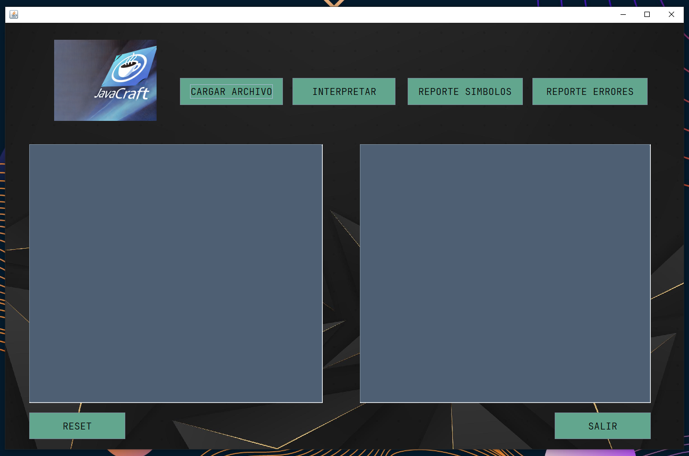
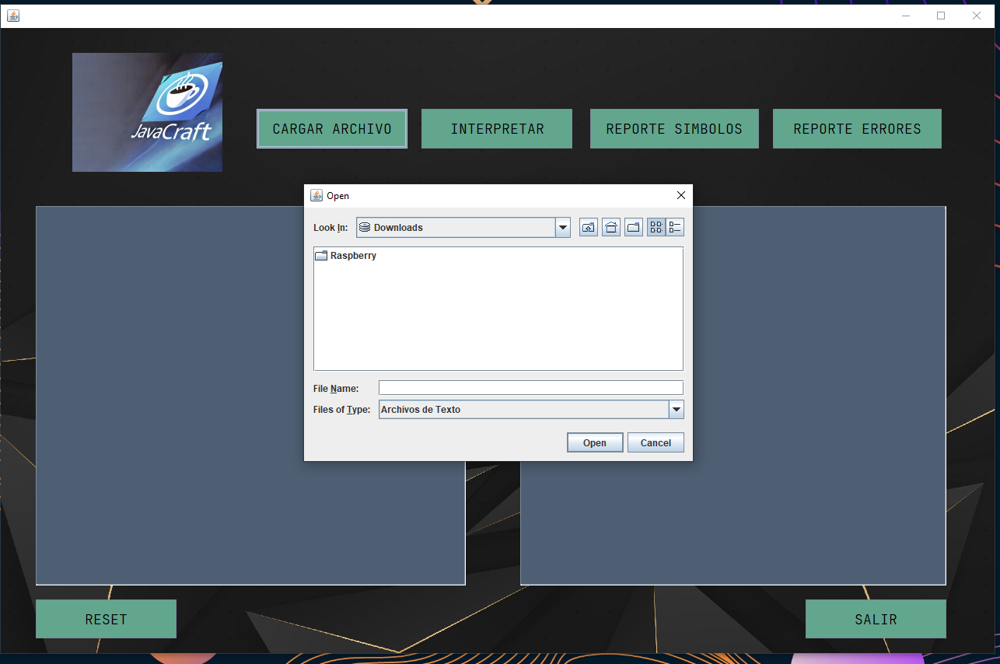
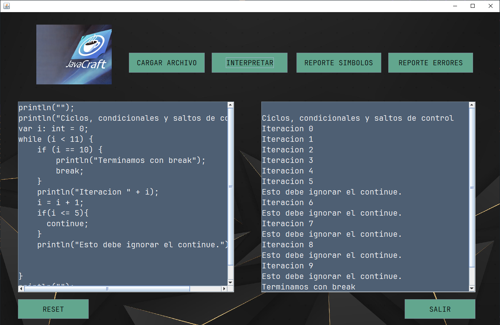
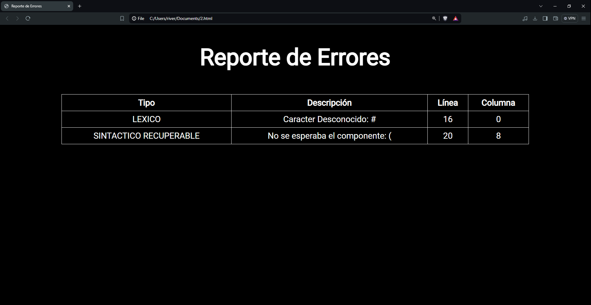
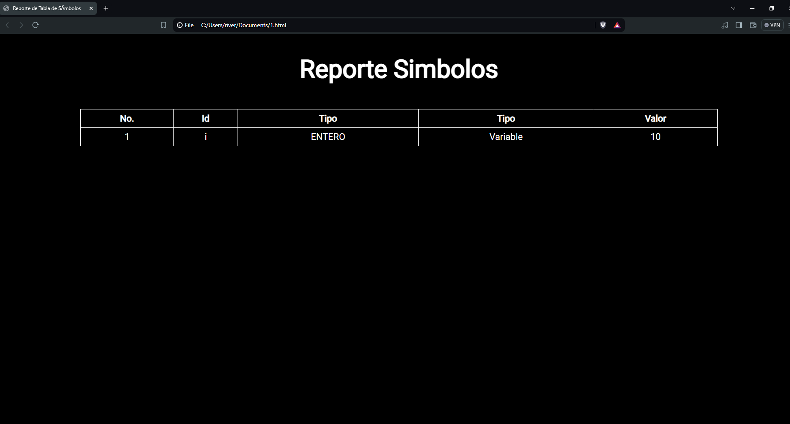
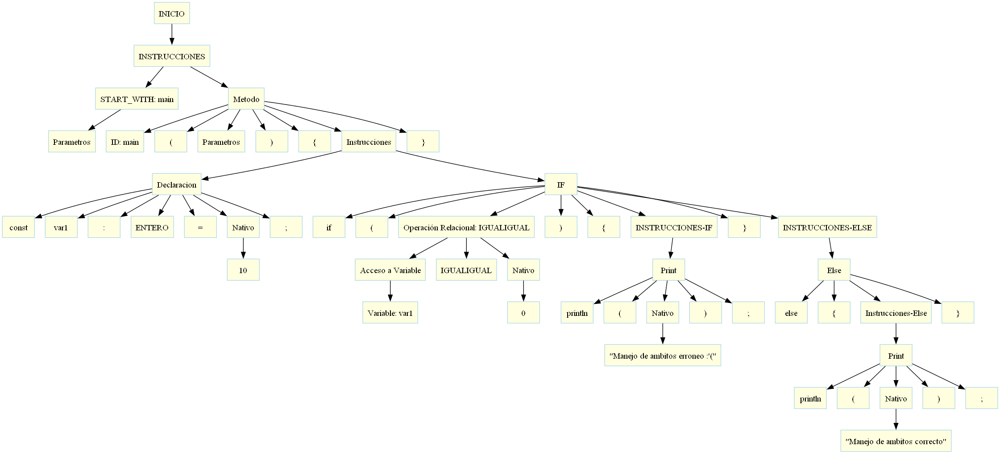

## ORGANIZACION DE LENGUAJES Y COMPILADORES 1 - FASE 1

## UNIVERSIDAD DE SAN CARLOS DE GUATEMALA
---

|**CARNET**  |      **NOMBRE COMPLETO**          |  
|----------|:-----------------------------------:|
|202100096 |  RIVER ANDERSON - ISMALEJ ROMAN     |    
| AUXILIAR |            FABIAN REYNA             |   
| SECCION  |                "P"                  |  

---

#### 📌 MANUAL USUARIO
---

### **Objetivo General**
* Aplicar los conocimientos sobre la fase de análisis léxico y sintáctico de un
compilador para la construcción de una solución de software.

### **Objetivo Específico**
* Que el estudiante aprenda a generar analizadores léxicos y sintácticos
utilizando las herramientas de JFLEX y CUP.

---
>### **Pantalla Inicial**

* Al iniciar el ejecutable del programa nos encontraremos con una interfaz grafica donde contaremos con varias opciones.

    

---
>### **Cargar Archivos**
* Al presionar el boton de cargar archivos se nos abrirá un explorador para poder seleccionar el archivo.

    

**Nota**
* Los archivos deberán estar en extension .df. Y deberán de tener un estructura en especifica para el procesamiento de ello.

---
>### **INTERPRETAR**
* Luego de cargar el archivo este se mostrará en la parte izquierda de la interfaz. Seguido de eso se podrá procesar la entrada presionando el botón de **Interpretar** y el resultado se mostrará en la parte derecha.

    

---
>### **Reporte Errores**
* Al ejecutar el archivo, si la entrada contiene **Errores Léxicos, Errores Sintacticos o Errores Semánticos** se podrá generar un reporte en formato .html y el usario podrá guardarlo en su Equipo al guardarlo se abrirá automáticamente en un navegador para poder visualizar los errores encontrados.

    

    

---
>### **Reporte Simbolos**
* Al ejecutar el archivo, podremos generar una tabla de **Simbolos** que fueron procesados en la entrada, este reporte se generará con extensión .html se podrá guardar en el equipo al guardarlo se abrirá automáticamente en un navegador para poder visualizar el reporte.

    

---
>### **Reporte AST**

    

---
>### **RESET**
* Se limpia las 2 áreas de texto para poder cargar un siguiente archivo y asi sucesivamente su funcion principal es la de no dejar que se enciclen los reportes.
---
>### **Salir**
* El programá se cerrará automáticamente.

---
#### 📌 MANUAL TECNICO
---

>##### **Análisis Léxico**

| Descripción                | Patrón                           | Expresión Regular              | Ejemplo         | Nombre Token    |
|----------------------------|----------------------------------|---------------------------------|-----------------|-----------------|
| Número entero              | Dígitos                          | [0-9]+                          | 123             | T_ENTERO       |
| Número decimal             | Número decimal                   | [0-9]+\.[0-9]+                  | 123.45          | T_DECIMAL      |
| Caracter                   | Caracter entre comillas simples  | '[^']'                          | 'a'             | T_CARACTER     |
| Cadena de caracteres       | Texto entre comillas dobles      | \"[^\"\n]*\"                    | "texto"         | T_CADENA       |
| Identificador              | Letra seguida de letras, números o guión bajo | [a-zA-z][a-zA-Z0-9_]*  | var123          | T_ID           |
| Booleano                   | true o false                     | true\|false                     | true            | T_BOLEANO      |
| Imprimir en consola        | println                          | println                         | println         | T_PRINTLN      |
| Variable                   | var                              | var                             | var             | T_VAR          |
| Constante                  | const                            | const                           | const           | T_CONST        |
| Tipo de dato entero        | int                              | int                             | int             | T_INT          |
| Tipo de dato double        | double                           | double                          | double          | T_DOUBLE       |
| Tipo de dato string        | string                           | string                          | string          | T_STRING       |
| Tipo de dato booleano      | bool                             | bool                            | bool            | T_BOOL         |
| Tipo de dato caracter      | char                             | char                            | char            | T_CHARACTER    |
| Inicio de bloque           | {                                | {                               | {               | T_BRACKETIZ    |
| Fin de bloque              | }                                | }                               | }               | T_BRACKETDER   |
| Inicio de paréntesis       | (                                | (                               | (               | P_LEFT         |
| Fin de paréntesis          | )                                | )                               | )               | P_RIGHT        |
| Punto y coma               | ;                                | ;                               | ;               | T_SEMICOLON    |
| Dos puntos                 | :                                | :                               | :               | T_COLON        |
| Incremento                 | ++                               | ++                              | ++              | T_INCREMENT    |
| Decremento                 | --                               | --                              | --              | T_DECREMENT    |
| Suma                       | +                                | +                               | +               | T_PLUS         |
| Resta                      | -                                | -                               | -               | T_MINUS        |
| Multiplicación             | *                                | *                               | *               | T_TIMES        |
| División                   | /                                | /                               | /               | T_DIVIDE       |
| Potencia                   | **                               | **                              | **              | T_POW          |
| Módulo                     | %                                | %                               | %               | T_MOD          |
| Igualdad                   | ==                               | ==                              | ==              | T_TWOEQUAL     |
| Asignación                 | =                                | =                               | =               | T_EQUAL        |
| Diferencia                 | !=                               | !=                              | !=              | T_NOTEQUAL     |
| Menor o igual que          | <=                               | <=                              | <=              | T_LESSTHANEQUAL|
| Menor que                  | <                                | <                               | <               | T_LESSTHAN     |
| Mayor o igual que          | >=                               | >=                              | >=              | T_GREATERTHANEQUAL|
| Mayor que                  | >                                | >                               | >               | T_GREATERTHAN  |
| OR lógico                  | \|\|                             | \|\|                            | \|\|            | T_OR           |
| AND lógico                 | &&                               | &&                              | &&              | T_AND          |
| XOR lógico                 | ^                                | ^                               | ^               | T_XOR          |
| NOT lógico                 | !                                | !                               | !               | T_NOT          |
| IF                         | if                               | if                              | if              | T_IF           |
| ELSE                       | else                             | else                            | else            | T_ELSE         |
| FOR                        | for                              | for                             | for             | T_FOR          |
| BREAK                      | break                            | break                           | break           | T_BREAK        |
| CONTINUE                   | continue                         | continue                        | continue        | T_CONTINUE     |
| WHILE                      | while                            | while                           | while           | T_WHILE        |
| DO                         | do                               | do                              | do              | T_DO           |
| Comentario de una línea    | Comentario iniciado con "//"     | "//" [^\n]*                     | // comentario   | *Ignorado*     |
| Comentarios multilínea     | Comentarios entre "/*" y "*/"    | "/*" [^*]* ("*" [^/]+)* "*/"   | /* comentario */| *Ignorado*     |
| Espacios en blanco         | Espacios, tabulaciones, nuevas líneas |                               |                 | *Ignorado*     |
| Carácter Desconocido       | Cualquier otro carácter no reconocido | .                           | \_              | *Ignorado*     |

---

>##### **Análisis Sintáctico**

- [Gramatica](Gramatica.md)

